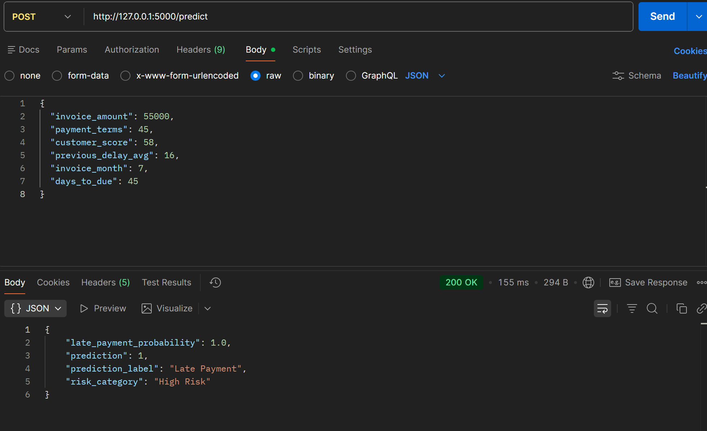
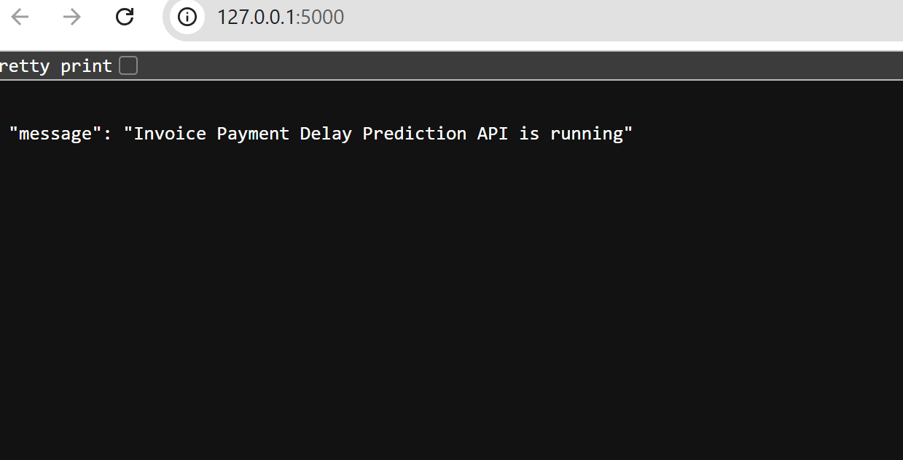

# AI-Powered Invoice Payment Delay Prediction System

## Overview
This project predicts whether an invoice will be paid late using machine learning. It simulates real-world financial workflows such as invoice risk analysis and payment prediction.

## Features
- Machine learning model for late payment prediction
- REST API using Flask
- Risk categorization (Low / Medium / High)
- Real-time prediction using JSON input

## Tech Stack
- Python
- Flask
- Pandas, NumPy
- Scikit-learn
- Postman

## How it Works
1. Invoice data is processed using Pandas
2. Model predicts whether payment will be late
3. API returns prediction, probability, and risk level

## API Endpoint

POST /predict

Sample Input:
```json
{
  "invoice_amount": 55000,
  "payment_terms": 45,
  "customer_score": 58,
  "previous_delay_avg": 16,
  "invoice_month": 7,
  "days_to_due": 45
}
```
## Screenshots

### Postman Response 1


### Postman Response 2


### Server Running

